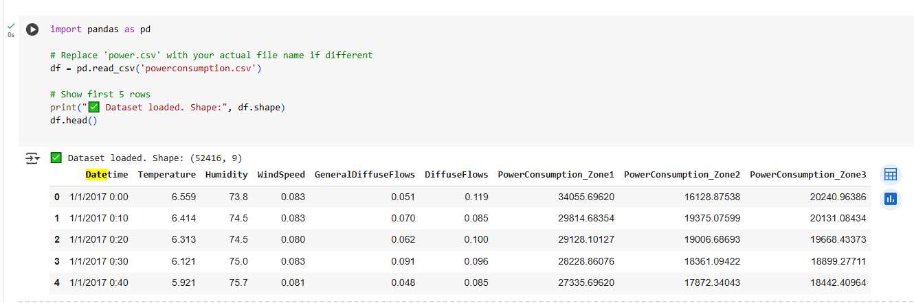
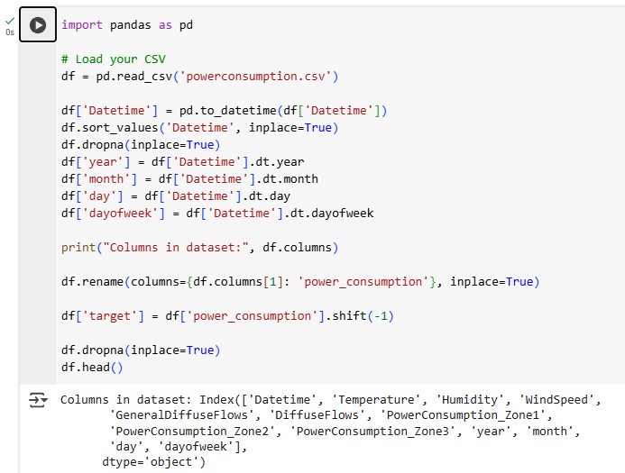
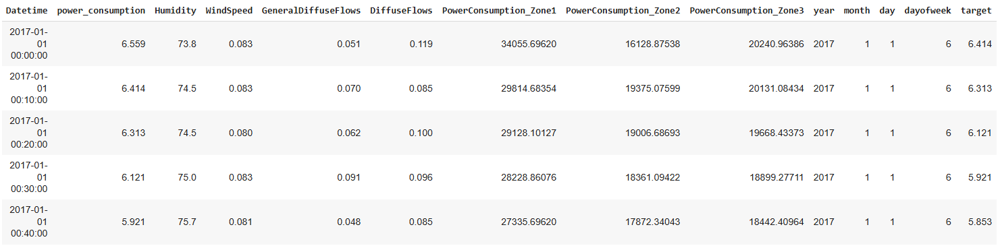
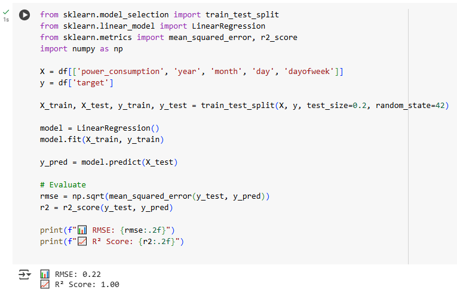
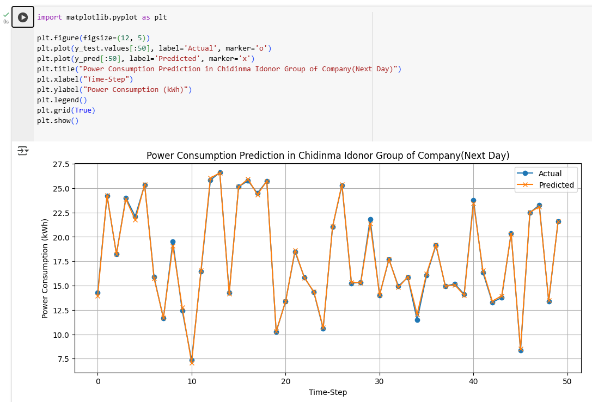
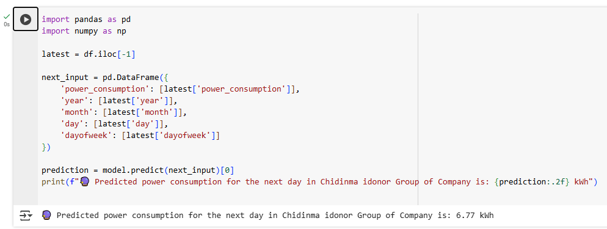

<h1>Power Consumption Prediction</h1>

### [YouTube Demonstration](https://youtu.be/jdz9wYqydS0)

<h2>Description</h2>
Predicting power consumption accurately helps utilities and consumers optimize energy usage, reduce costs, and support sustainable energy management.

This project demonstrates:

- Loading and preprocessing real-world power consumption data
- Feature engineering from datetime values
- Training a Linear Regression model for next-day consumption forecasting
- Model evaluation with RMSE and R² metrics
- Visualization of actual vs predicted power consumption
- Predicting future power usage based on latest data

 

This repository contains a simple yet effective machine learning project to predict **next-day power consumption** based on historical power usage data. The project uses a Linear Regression model trained on time-series features extracted from daily power consumption data.

---
<h2> 📊 Code Summary</h2>

-Load CSV and convert datetime column to datetime type

-Create features like year, month, day, day of week

-Shift power consumption column to create the target for the next day

-Split data into training and testing sets

-Train Linear Regression model on the features

-Evaluate the model performance with RMSE and R² score

-Plot actual vs predicted power consumption for test data

-Predict power consumption for the day after the latest date in dataset

<h2>📈 Model Performance Metrics</h2>

-RMSE (Root Mean Squared Error): Measures average prediction error magnitude

-R² Score (Coefficient of Determination): Indicates how well the model explains variance in data (closer to 1 is better)

<h2>📈 🔮 Predicting Future Consumption</h2>

The model uses the most recent power consumption and date features to predict power consumption for the next day, supporting simple forward-looking energy management.

<h2> 🧰 Dependencies</h2>

-Python 3.x

-pandas

-numpy

-scikit-learn

-matplotlib

-seaborn

<h3>Phase one: Loading and Inspection of the Dataset<h3>

<h3>Phase two: Next, we preprocess the data<h3>

<h3>Phase three: We split the data and then train the model<h3>

<h3>Phase four: This is where our prediction is visualised<h3>

<h3>Phase six: Next day prediction<h3>

